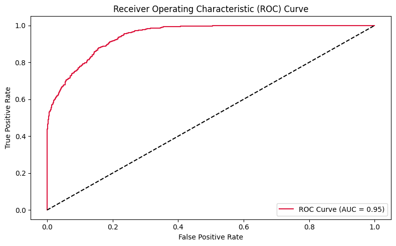
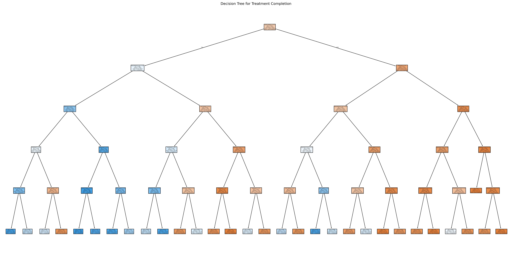

# Predicting Counseling Dropout Risk

In counseling, specifically in substance abuse recovery programs, clients often discontinue treatment before completion. These dropouts can hinder recovery outcomes and strain support systems. By using machine learning to predict which clients are more likely to leave early, we can design proactive interventions to improve retention and care quality.

This project builds a predictive pipeline using cleaned anonymous client data to identify clients at risk based on demographic, clinical, and psychosocial features. Decsion trees and Neural Networks were used in this project.

----------------------------------------------------------------------------------

## Features Used

This project uses structured, interpretable features that are commonly associated with treatment engagement and risk of dropout. The features span demographic, behavioral, and clinical domains:

- **Age** – Client's age at intake
- **Gender** – Male or Female
- **Employed** – Employment status at the time of intake
- **Housing_Status** – Stability of housing (e.g., stable, unstable, homeless)
- **Education_Level** – Highest education level completed
- **Used_Before_Puberty** – Whether substance use began before puberty
- **Polysubstance_Use** – Use of multiple substances concurrently
- **HIV_Status** – Positive or negative HIV diagnosis
- **Chronic_Illness** – Presence of other chronic medical conditions
- **Single_Parent_Household** – Whether raised in a single-parent household
- **Prior_Rehab** – Has previously been in rehabilitation or counseling
- **Race** – Self-identified race or ethnicity
- **Substance_Use_Duration_Years** – Total years of substance use
- **Treatment_Type** – Voluntary or court-mandated participation
- **Arrest_History** – History of arrest or criminal justice involvement
- **Marital_Status** – Relationship status (e.g., single, married, divorced)

To understand how each feature varies across clients who complete vs. those who drop out, we plotted distributions grouped by treatment outcome.

**One of the features: Gender Distribution by Completion Status**

##  Feature Importance

Not all of these features contribute equally to predicting whether a client will complete counseling. Some variables,such as prior rehab experience or arrest history, carry more weight in the model's decision-making process.

To quantify this, we trained a **Random Forest** model, which naturally ranks features based on how much they reduce impurity across decision trees. This gives us a clear view of which attributes are most influential in predicting dropout.

**Random Forest Feature Importance**

## Correlation & Training the Model

After identifying important features, we computed the **correlation matrix** to explore relationships between them. This helped us identify redundancy and dependencies among inputs before feeding them into more complex models. We observed that a shallow model (ANN) is ideal as most features have low correlation. The model was trained using binary cross-entropy loss and evaluated on both training and validation data.

**Training & Validation Loss Over Epochs**

## Model Evaluation – ROC Curve

To assess our neural network, we plotted the **Receiver Operating Characteristic (ROC) curve**. This curve visualizes the trade-off between true positive rate and false positive rate across classification thresholds.

The **Area Under the Curve (AUC)** gives a single metric of overall model quality. An AUC close to 1.0 indicates strong performance.

📊 **ROC Curve for Neural Network**

## Training vs. Validation Gap

While the deep neural network achieved reasonable performance, we observed a growing gap between training and validation loss as epochs increased. This suggests potential **overfitting**, where the model starts to memorize training data rather than generalize well to unseen examples.

To address this and improve interpretability, we explored a **Decision Tree classifier**. They are in fact particularly valuable in healthcare contexts because they provide **transparent, rule-based predictions**, allowing practitioners and counsellors to understand and trust the reasoning behind each prediction.

 **Visualized Decision Tree Structure**

---------------------------------------------------------------------------------------------

##  Model Comparison

We evaluated both a Deep Neural Network (DNN) and a Decision Tree classifier using key performance metrics. While both models performed similarly in terms of overall accuracy, the **Decision Tree offered higher precision when predicting who would *not complete* counseling**, which aligns with our goal of intervening early with at-risk clients.

| Metric                     | DNN         | Decision Tree |
|----------------------------|-------------|----------------|
| **Accuracy**               | 0.85        | 0.84           |
| **Precision (Not Complete)** | **0.86**    | **0.93**       |
| **Recall (Not Complete)**    | 0.90        | 0.81           |
| **F1-Score (Not Complete)**  | 0.88        | 0.86           |
| **Precision (Complete)**     | 0.83        | 0.74           |
| **Recall (Complete)**        | 0.77        | 0.90           |
| **F1-Score (Complete)**      | 0.80        | 0.81           |

> **Priority**: In this context, we care most about **high precision when predicting "Not Complete"**. This ensures that when we flag someone as high-risk, we can be confident in that prediction, and allocate resources accordingly. When our models predict that a client **will not complete** counseling:

- The **Decision Tree** is correct about **93%** of the time (high precision).
- The **DNN** is correct about **86%** of the time.

